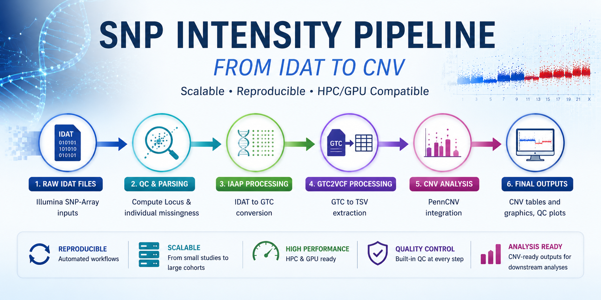

<div align="center">

# 🧬 jlm-bioinformatics

# Scalable Bioinformatics Infrastructure & Genomic Analysis Workflows

### SNP-array • SNV • CNV • HPC • GPU • Reproducible Pipelines

</div>

---

# 👋 About

Hi, I'm **Jean-Louis Martineau**.

I build scalable and reproducible bioinformatics workflows that help researchers, laboratories, and genomics teams transform raw genomic data into analysis-ready results.

My work focuses on:

- SNP-array preprocessing
- SNV/WES/WGS analysis pipelines
- CNV-ready signal generation
- genomic quality control systems
- HPC & GPU optimization
- reproducible computational infrastructure

---

# 🚀 How I Help Research Teams & Genomics Projects

I help teams solve common bioinformatics workflow challenges such as:

❌ fragmented preprocessing pipelines  
❌ computational inefficiencies  

By building:

✅ automated workflows  
✅ scalable genomic infrastructure  
✅ reproducible pipelines  
✅ transparent QC systems  
✅ high-throughput analysis frameworks  

---

# 🔬 Core Expertise

## 🧬 SNP-array Processing & CNV Workflows

Development of scalable Illumina SNP-array workflows including:

- IDAT preprocessing
- genotype extraction
- BAF/LRR signal generation
- probe & sample QC
- PFB estimation
- CNV-ready signal preparation
- PennCNV integration

---

## 🧪 SNV / WES / WGS Pipelines

Reproducible workflows for:

- variant calling
- variant filtering
- annotation pipelines
- preprocessing automation
- downstream genomic analysis

---

## 🤖 Machine Learning for Genomics

Current and future work includes:

- variant prioritization
- deleteriousness prediction
- genomic feature engineering
- ML-assisted genomic interpretation

---

## ⚙️ Bioinformatics Infrastructure Engineering

Scalable infrastructure for genomic analysis environments:

- Snakemake workflows
- HPC deployment
- GPU acceleration
- parallel execution
- cloud-compatible systems
- reproducibility engineering

---

# 📦 Featured Projects

# 🔹 SNP_intensity_data_tools

A scalable and reproducible workflow for processing Illumina SNP-array IDAT data into QC-ready and CNV-compatible outputs.

# ⚙️ Workflow Overview

<div align="center">



👉 Detailed project page:  
[`projects/SNP_intensity_data_tools.md`](projects/SNP_intensity_data_tools.md)

</div>

---

### Workflow Features

✅ IDAT → GTC → TSV preprocessing  
✅ BAF / LRR extraction  
✅ probe & sample QC  
✅ PFB estimation  
✅ scalable execution  
✅ optional GPU acceleration  
✅ PennCNV compatibility  

---

# 💼 Available Services

## 🟢 SNP-array QC & Troubleshooting

- QC interpretation
- problematic sample detection
- signal quality assessment
- troubleshooting support

---

## 🟡 Genomic Workflow Development
- custom Snakemake pipelines
- preprocessing automation
- reproducibility engineering
- scalable workflow design

---

## 🔴 HPC & GPU Optimization
- multi-threaded execution
- HPC deployment
- scalable cohort processing
- GPU acceleration strategies

---

## 🔵 Consulting & Collaboration

Open to:
- research collaborations
- consulting contracts
- workflow optimization projects
- genomic infrastructure development

---

# 🤝 Why Work With Me

I focus on building bioinformatics infrastructure that is:

✅ reproducible  
✅ scalable  
✅ automation-oriented  
✅ transparent  
✅ production-ready  

My goal is not simply to process genomic data, but to engineer workflows that remain maintainable, extensible, and reliable for real-world research environments.

---

# 🧰 Technologies

## Languages
- Python
- Bash

## Workflow Systems
- Snakemake

## Bioinformatics Tools
- bcftools
- samtools
- htslib
- PennCNV

## Infrastructure
- Linux
- HPC clusters
- GPU computing
- cloud-compatible systems

---

# 📚 Repository Structure

```text
jlm-bioinformatics/
├── README.md
├── projects/
├── case-studies/
├── services/
├── assets/
└── LICENSE
````

---

# 📫 Contact

## Work With Me

If you need help with:

* genomic preprocessing
* SNP-array workflows
* scalable bioinformatics infrastructure
* reproducible pipeline engineering
* QC systems
* HPC/GPU deployment

feel free to reach out.

📧 **Professional Email**
[martineau.jeanlouis.bioinfo2017@gmail.com](mailto:martineau.jeanlouis.bioinfo2017@gmail.com)

---

# 🌍 Vision

Building scalable, reproducible, and accessible computational infrastructure for modern genomics and precision medicine.

---

# ⭐ Support

If you find these projects useful:

* star the repositories
* follow future developments
* share with the genomics community


